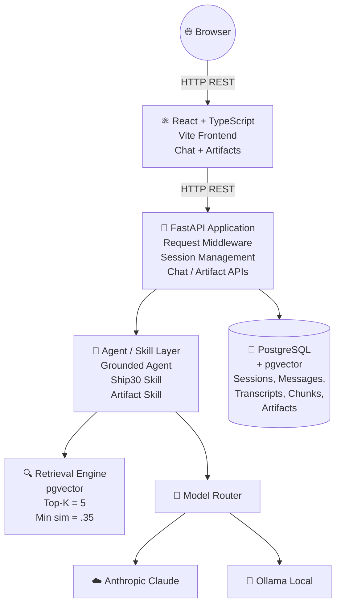
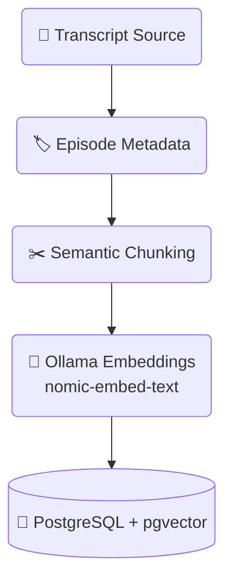
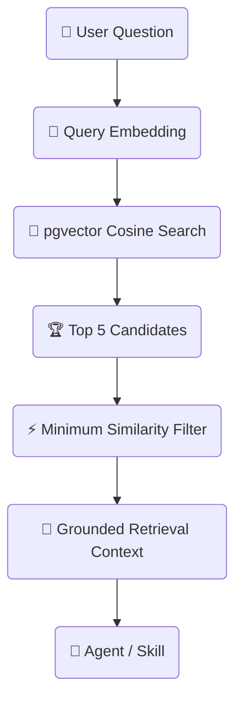
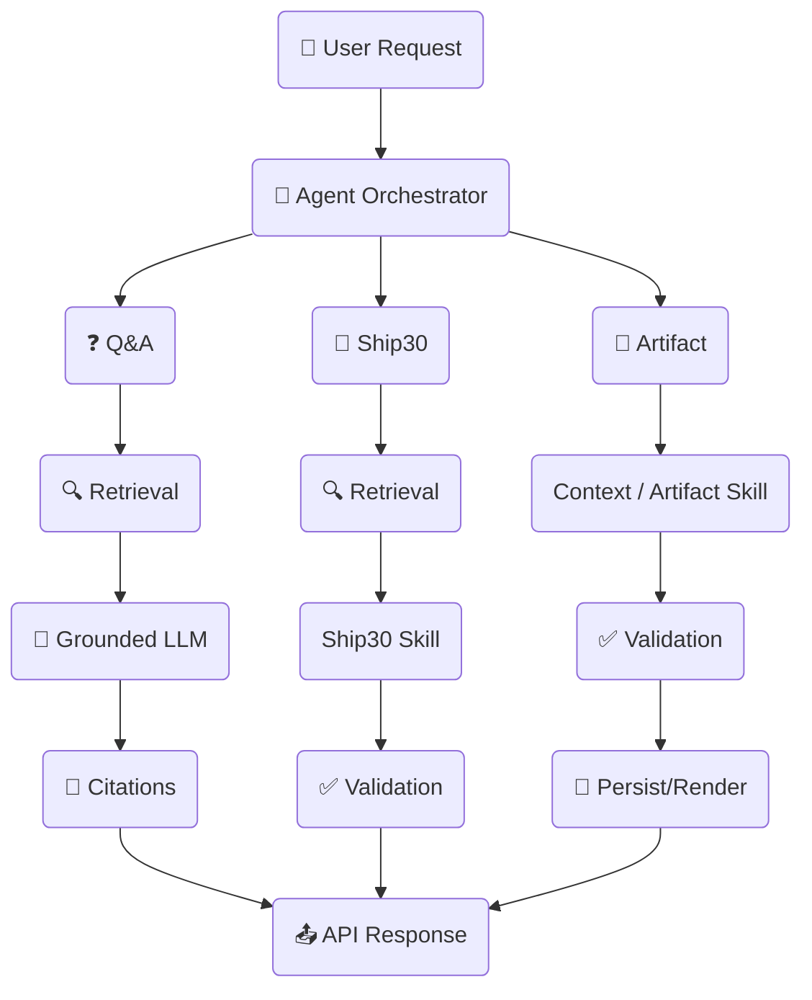
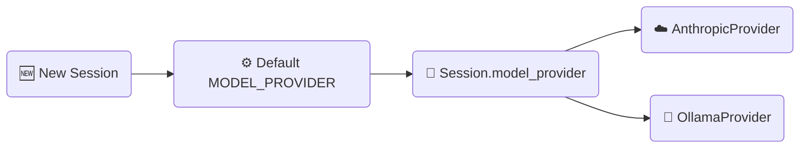
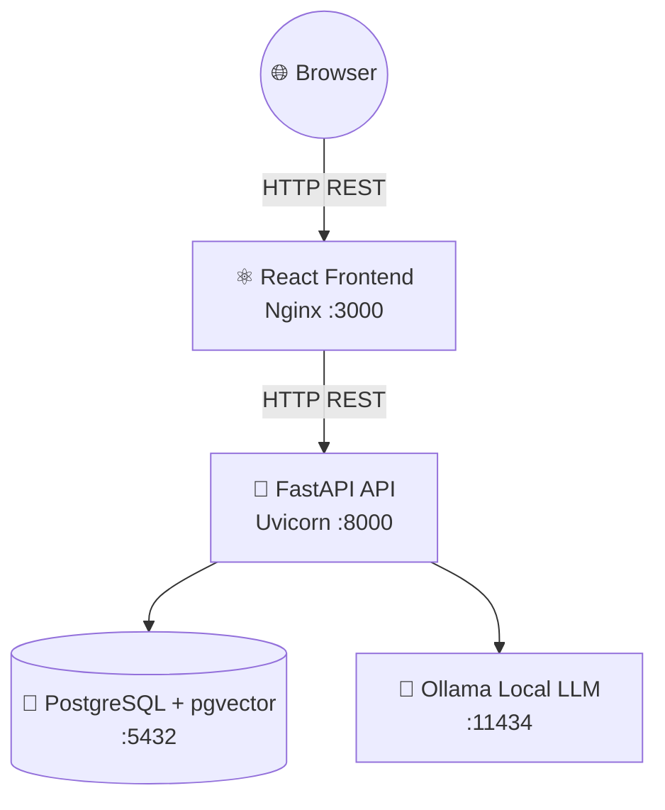

# 🏗️ Architecture

## 🎙️ The Lenny Growth Assistant

### 🌐 System Architecture

The **Lenny Growth Assistant** is a full-stack application built around a FastAPI backend, PostgreSQL with pgvector, a grounded agent layer, and a React frontend.

The system uses retrieval-augmented generation (RAG) to ground responses in the Lenny transcript knowledge base. Each user session has its own persisted conversation and model-provider selection.



### 🛠️ Technology Stack

| Layer | Technology |
|---|---|
| **Frontend** | React 18 + TypeScript + Vite |
| **UI** | Vanilla CSS + Lucide React |
| **Markdown Rendering**| react-markdown + remark-gfm |
| **API** | FastAPI + Uvicorn |
| **Database** | PostgreSQL 16 + pgvector |
| **ORM** | SQLAlchemy 2.x |
| **Migrations** | Alembic |
| **Embeddings** | Ollama nomic-embed-text |
| **Embedding Dim** | 768 |
| **Local LLM** | Ollama |
| **Cloud LLM** | Anthropic |
| **LLM Routing** | Custom LLMProvider abstraction |
| **Configuration** | pydantic-settings |
| **Logging** | Structured JSON logging |
| **Request ID** | X-Request-ID |
| **Deployment** | Docker Compose |
| **Frontend Server**| Nginx |

---

### 🧩 Component Boundaries

#### 1️⃣ React Frontend

The frontend is responsible for:
- Creating and switching chat sessions.
- Displaying persisted conversation history.
- Sending chat requests to the FastAPI backend.
- Displaying grounded answers and source citations.
- Switching the model provider for the active session.
- Displaying insufficient-evidence responses.
- Requesting Ship30 essays.
- Displaying generated Markdown and HTML artifacts.
- Rendering Markdown safely.
- Rendering HTML artifacts inside a sandboxed iframe.

> The frontend **does not** independently generate citations or invent source metadata. Citation data displayed in the UI comes strictly from the backend response.

#### 2️⃣ FastAPI Application

FastAPI is the main application boundary. It is responsible for:
- Request validation.
- Session management.
- Message persistence.
- Provider selection.
- Chat orchestration.
- Retrieval.
- Ship30 generation.
- Artifact generation.
- Health and readiness checks.
- Structured request logging.
- Error handling and graceful failures.

> Request middleware generates or validates an `X-Request-ID` and makes it available for request correlation.

#### 3️⃣ Agent and Skill Layer

The application uses one primary orchestration path with specialized skills rather than several independent agents.

**GroundedConversationalAgent**
Responsible for normal conversational Q&A. The agent:
- Receives the user message and recent session context.
- Retrieves relevant transcript chunks.
- Builds a grounded retrieval context.
- Exposes retrieved evidence using short references such as `[REF-1]`.
- Calls the selected LLM provider.
- Extract references returned by the model.
- Maps valid `[REF-N]` references back to the original retrieved chunks.
- Returns only validated citations.
- Falls back to an insufficient-evidence response when the model does not provide valid evidence references.

> 🛡️ The system never automatically treats every retrieved chunk as a citation. A citation must be explicitly referenced by the model and must correspond to a chunk retrieved for that request.

**Ship30Skill**
Responsible for generating Ship30-style essays. The skill:
- Uses grounded retrieval context.
- Targets approximately 1,250 words.
- Accepts output between 1,100 and 1,400 words.
- Validates citation references and word count.
- Allows a maximum of two generation attempts.
- Uses a safe fallback when validation fails.

**ArtifactSkill**
Responsible for generating structured artifacts (Markdown, HTML/CSS).
Artifacts are associated with the current session and persisted in PostgreSQL.

---

### 📚 Knowledge Ingestion

Transcript data is processed through the ingestion pipeline.



#### Chunking Strategy
- **Target chunk size**: approximately 800 characters.
- **Overlap**: 0 characters between normal semantic segments.
- Oversized individual segments use a sliding-window strategy.
- Original timestamps and chunk ordering are preserved.

#### Embeddings
- **Provider**: Ollama
- **Model**: nomic-embed-text
- **Dimension**: 768

#### Ingestion Properties
The ingestion pipeline is designed to be repeatable and idempotent. Re-ingesting the same episode updates the existing transcript/chunk data instead of creating uncontrolled duplicates.

---

### 🔍 Retrieval Engine

The retrieval engine uses PostgreSQL and pgvector for vector similarity search.
- **RAG_TOP_K** = 5
- **RAG_MIN_SIMILARITY** = 0.35
- **Distance** = cosine
- **Dimension** = 768



#### Grounding References
Because local models may struggle to reproduce long UUIDs reliably, the agent context exposes retrieved chunks using short references:

```text
[REF-1]
Source: ...
Chunk ID: ...
Content: ...
```
The backend then maps `[REF-N]` references back to the original database chunk IDs and source metadata.

#### Insufficient Evidence
If retrieval does not provide adequate evidence, or the model fails to reference valid retrieved evidence, the system returns an explicit insufficient-evidence response instead of attaching unrelated citations.

---

### 🗄️ Database Schema

The PostgreSQL database is the system of record.

- **`sessions`**: Stores independent user conversation sessions.
- **`messages`**: Stores the conversation history (`user`, `assistant`).
- **`transcripts`**: Stores episode-level source metadata.
- **`chunks`**: Stores searchable transcript segments (`VECTOR(768)`).
- **`artifacts`**: Stores generated user-facing artifacts.

---

### 🛣️ API Endpoints

| Method | Endpoint | Purpose |
|---|---|---|
| `POST` | `/sessions` | Create a new session |
| `GET` | `/sessions/{session_id}` | Retrieve a session and its messages |
| `POST` | `/sessions/{session_id}/messages` | Send a user message |
| `PATCH`| `/sessions/{session_id}/provider` | Change the LLM provider |
| `POST` | `/sessions/{session_id}/essay` | Generate a grounded Ship30 essay |
| `POST` | `/sessions/{session_id}/artifacts`| Generate a Markdown/HTML artifact |
| `GET` | `/sessions/{session_id}/artifacts`| Retrieve session artifacts |
| `POST` | `/ingest` | Ingest transcript data |
| `GET` | `/health` | Basic application health check |
| `GET` | `/health/ready` | Readiness check (DB availability) |

---

### 🔀 Agent Routing

The application uses a single main orchestration path and routes specialized requests to the appropriate capability.



---

### 🔄 Model Provider Switching

The provider is session-scoped.



Changing the provider through `PATCH /sessions/{session_id}/provider` updates only the selected session.

---

### 🛡️ Artifact Viewer and Security Boundary

Generated artifacts are treated as untrusted content.

- **Markdown**: Rendered through `react-markdown` without injecting raw HTML into the parent DOM.
- **HTML**: Rendered using a sandboxed iframe: `<iframe sandbox="" srcDoc="..."></iframe>`. A restrictive CSP is applied:
  `default-src 'none'; style-src 'unsafe-inline'; img-src data:;`

---

### 🔐 Session Isolation

Every conversation is associated with a session ID. The backend uses the session ID when retrieving messages, artifacts, provider config, and context. Automated tests verify that data from one session cannot be returned through another session's endpoints.

---

### 📊 Observability

Structured JSON logging includes Request ID, Session ID, Provider, Latency, Retrieval metadata, and Citations. Middleware uses `X-Request-ID` for correlation.

---

### 🏗️ Deployment Topology

Designed to run through Docker Compose.



---

### 💡 Design Principles

1. **Grounded Over Impressive**: Prioritizes evidence-backed answers over confident but unsupported answers.
2. **Explicit Source Traceability**: Every accepted citation maps back to a retrieved chunk.
3. **Session-Scoped State**: Conversation history belongs to the current session.
4. **Specialized Capabilities**: Coordinates focused capabilities instead of multiple disconnected agents.
5. **Secure by Default**: Generated HTML is treated as untrusted.
6. **Reproducible Deployment**: Built on Postgres, Docker Compose, and clear environment configuration.
